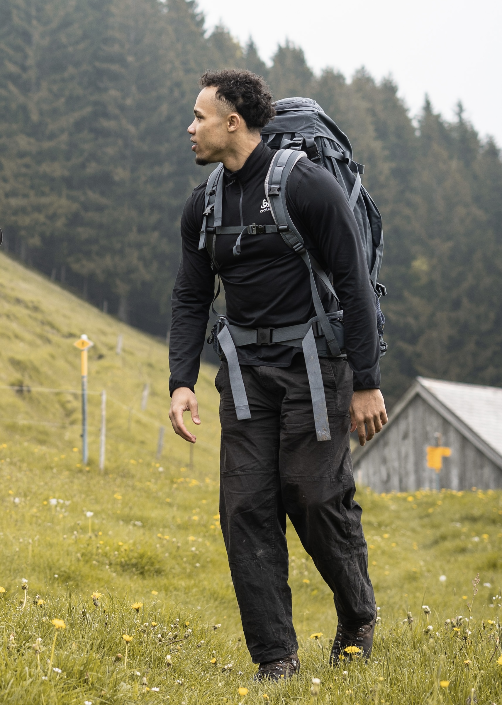
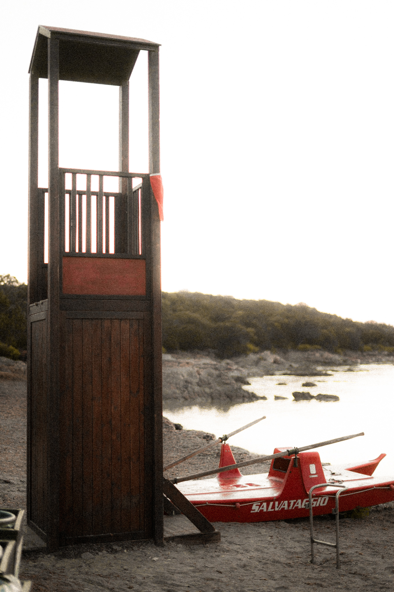

---
layout: page
title: Photography
permalink: /photography/
weight: 3
---

# Photography
**Sony Alpha 7 III**:camera:  
*Sigma 24mm 1.4* & *Sony FE 50mm 1.8*  

  
&nbsp; &nbsp; &nbsp; 
  

 

  
&nbsp; &nbsp; &nbsp; 
  

 

 

 

<!--
 

--
 

--
 
 
-->
 

 

 

 

